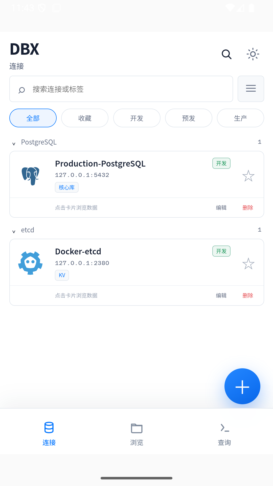
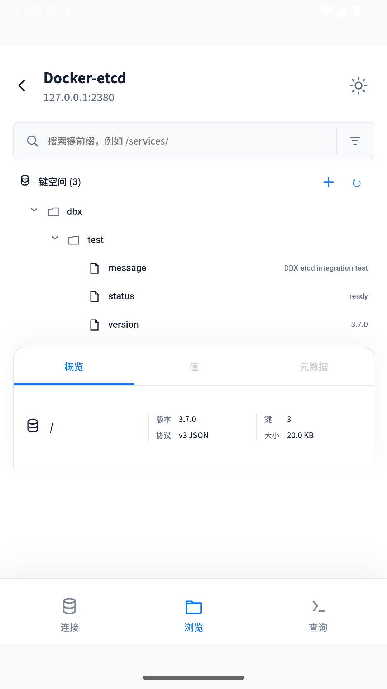
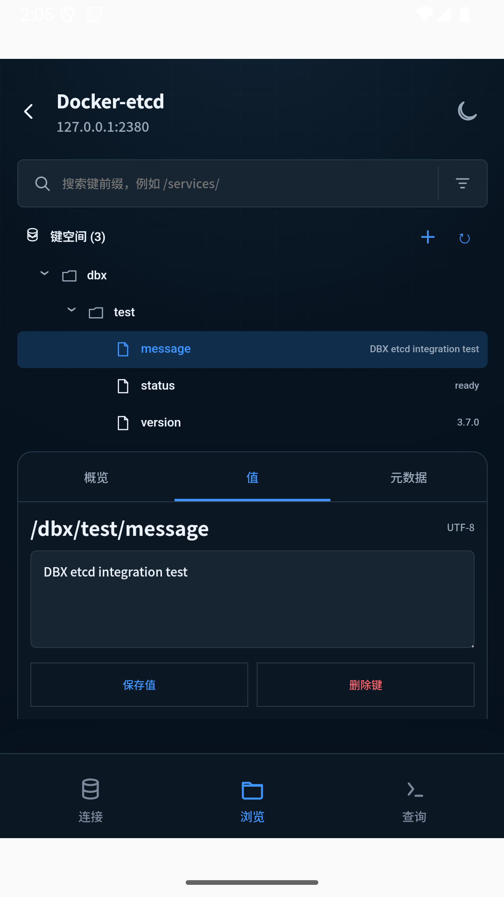

# Mobile DB Manager

[](https://github.com/CoolBanHub/mobile-db-manager/actions/workflows/android-release.yml)

语言：中文 | [英文版](README.en.md)

Mobile DB Manager 是一个可独立运行的 Android 数据库管理客户端。应用通过 Android
原生驱动从手机直接连接 PostgreSQL、MySQL/MariaDB、SQL Server、Redis、MongoDB
和 etcd，不需要部署 Web 服务，也不需要账号会话或移动端 API 网关。

## 运行效果

以下画面来自 Android 模拟器中的真实运行版本，etcd 数据由本地 Docker 测试容器提供。

| 连接管理 | etcd 键空间 | 键值详情 |
| --- | --- | --- |
|  |  |  |

## 功能范围

- 本机创建、编辑、测试、搜索、收藏、分组和删除数据库连接。
- 使用 Android Keystore AES-GCM 加密保存数据库密码、连接串、代理密码、SSH
  密码和私钥。
- 支持 PostgreSQL、MySQL/MariaDB、SQL Server 的元数据浏览、SQL 查询和表数据
  编辑。
- 支持 Redis Standalone 的 Key 浏览、编辑和 TTL 操作。
- 支持 MongoDB 的数据库、集合、文档浏览和文档编辑。
- 支持 etcd v3 JSON Gateway 的前缀查询、键值详情和单键写入。
- 支持 TLS、SSH 本地端口转发和 HTTP CONNECT 代理。
- 支持 SQL 格式化、具名 JSON 参数、元数据补全、查询取消、查询历史、本机 SQL
  收藏和结果导出分享。
- 支持从 GitHub Releases 检查最新 `release/v*` APK，并通过 Android 系统下载更新。

## 数据库支持

| 数据库 | 连接测试 | 浏览/查询 | 写入 |
| --- | --- | --- | --- |
| PostgreSQL | 支持 | 支持 SQL 与表数据 | 支持，需要主键 |
| MySQL / MariaDB | 支持 | 支持 SQL 与表数据 | 支持，需要主键 |
| SQL Server | 支持 | 支持 SQL 与表数据 | 支持，需要主键 |
| Redis Standalone | 支持 | 支持 Key 浏览 | 支持固定动作 |
| MongoDB | 支持 | 支持集合与文档 | 支持文档插入、替换、删除 |
| etcd | 支持 | 支持前缀与详情 | 支持 put/delete |

Redis 当前不支持 Sentinel 和 Cluster。MongoDB URI 已包含完整路由信息，不能同时
启用应用内 SSH 或 HTTP 隧道。etcd 需要启用 v3 JSON Gateway。

## 开发环境

- Node.js 22.13 或更高版本
- pnpm 10.27.0
- JDK 21
- Android SDK 36
- Android 8.0（API 26）或更高版本的设备或模拟器

## 常用命令

安装依赖：

```bash
pnpm install --frozen-lockfile
```

运行前端单元测试：

```bash
pnpm test
```

构建 WebView 资源并同步 Capacitor Android 工程：

```bash
pnpm sync
```

构建 Debug APK：

```bash
pnpm android:build:debug
```

APK 输出位置：

```text
android/app/build/outputs/apk/debug/app-debug.apk
```

打开 Android Studio：

```bash
pnpm open
```

运行 Android 本地单元测试：

```bash
cd android
./gradlew :app:testDebugUnitTest
```

连接设备后运行仪器测试：

```bash
pnpm android:device:test
```

## 项目结构

详细代码定位见 [代码地图](docs/CODEMAP.md)。

前端页面放在 `src/features/`：

- `connections/`：连接管理。
- `query/`：SQL 工作台、历史和收藏。
- `browse/relational/`：关系型数据库元数据和表数据浏览。
- `browse/redis/`、`browse/mongo/`、`browse/etcd/`：各自数据库的数据浏览器。
- `update/`：GitHub Release 更新提示和下载入口。

前端直连数据库 API 放在 `src/lib/direct/`，按职责拆分：

- `connections.ts`：连接列表、保存、删除和测试。
- `metadata.ts`：库、schema、表、字段、索引等元数据读取。
- `query.ts`：SQL 执行、取消、Explain。
- `tableData.ts`：表格数据浏览和行级增删改。
- `redis.ts`、`mongo.ts`、`etcd.ts`：各自数据库的数据浏览和固定写入动作。
- `history.ts`、`savedSql.ts`：本机历史记录和 SQL 收藏。
- `native.ts`、`localStore.ts`：Capacitor 原生桥接和本机 localStorage 工具。

应用更新 API 放在 `src/lib/appUpdate.ts`，它只负责调用 Android `AppUpdate`
插件，不混入数据库直连 API。

Android 原生直连代码在
`android/app/src/main/java/com/coolbanhub/mobiledbmanager/`：

- `DirectDatabasePlugin.java`：Capacitor 入口，只做参数读取、安全门和分发。
- `DirectJdbcConnectionFactory.java`：PostgreSQL、MySQL/MariaDB、SQL Server
  的 JDBC URL、驱动加载、SSL 和隧道接入。
- `DirectJdbcMetadata.java`：JDBC 元数据读取。
- `DirectJdbcQueryRunner.java`：SQL 执行、分页、结果序列化和取消。
- `DirectRedisActions.java`、`DirectMongoActions.java`、`DirectEtcdActions.java`：
  面向界面的动作映射和写入保护。
- `DirectRedisConnection.java`、`DirectMongoConnection.java`、
  `DirectEtcdConnection.java`：各数据库的底层连接客户端。
- `DirectTransport.java`：SSH 转发和 HTTP CONNECT 隧道。
- `DirectConnectionStore.java`、`SecureVaultStore.java`：连接配置和敏感信息保存。
- `AppUpdatePlugin.java`、`AppReleaseUpdateService.java`、`AppUpdateVersion.java`：
  GitHub Release 检查、APK 下载和版本比较。

新增数据库类型时，优先新增对应的前端 API 文件、原生 action 文件和底层连接
客户端，不要继续把逻辑堆到 `DirectDatabasePlugin.java` 里。

## GitHub Release

推送 `release/v*` 标签会触发 GitHub Actions 构建 Debug APK，并上传到对应的
GitHub Release。

```bash
git tag release/v0.1.0
git push origin release/v0.1.0
```

也可以在 GitHub Actions 页面手动运行 `Android Release APK` workflow，并填写
类似 `release/v0.1.0` 的标签。

workflow 会从 `release/vMAJOR.MINOR.PATCH` 自动设置 Android `versionName`
和递增 `versionCode`，应用内更新检查也使用同一套规则。

## 发布签名

发布前设置以下环境变量：

- `MOBILE_DB_MANAGER_ANDROID_KEYSTORE`
- `MOBILE_DB_MANAGER_ANDROID_STORE_PASSWORD`
- `MOBILE_DB_MANAGER_ANDROID_KEY_ALIAS`
- `MOBILE_DB_MANAGER_ANDROID_KEY_PASSWORD`
- `MOBILE_DB_MANAGER_ANDROID_VERSION_CODE`
- `MOBILE_DB_MANAGER_ANDROID_VERSION_NAME`

然后执行：

```bash
pnpm android:release
```

发布包输出位置：

```text
android/app/build/outputs/bundle/release/app-release.aab
```

密钥库和密码只能通过环境变量提供，不得提交到仓库。

## 安全建议

- 使用 WireGuard、Tailscale 或企业 VPN 接入数据库内网。
- 不要把生产数据库端口直接暴露到公网。
- 使用独立的最小权限数据库账号。
- 为允许写入的生产连接开启生产保护。
- TLS 优先选择“验证证书和主机名”；“仅加密”只用于受控自签名环境。
- SSH 连接填写服务器 SHA256 主机密钥指纹。

## Android 驱动兼容层

Android 不包含完整 Java SE 的 `java.lang.management` 和 JMX。构建脚本会为部分
驱动生成 Android 专用兼容 Jar：

- PostgreSQL：替换结果缓冲区内存检测。
- MySQL / MariaDB：移除连接池 JMX 注册。
- MongoDB：移除 JMX 注册，并补充 Android 缺失的 SASL 类型契约。

SQL Server 使用 Android ART 兼容的 jTDS 驱动。
